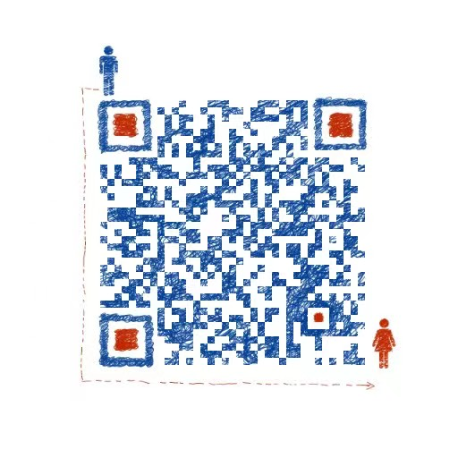

# chatGPT-wx
关于由openAI公司发布的大型预训练语言模型chatGPT3.5接入微信小程序

项目演示地址：

技术爱好者交流群：

需求定制联系：

--------------------------------------------------------------------
api说明
chats1
用的官方api3.5，需要api key100 个轮播速度飞起

chats2
用的反代理，调用官网gpt3.5接口，需要accessToken，accessToken获取地址 https://chat.openai.com/api/auth/session

官网用的EventSource，小程序不支持EventSource，只能接口一次性返回后截取答案

